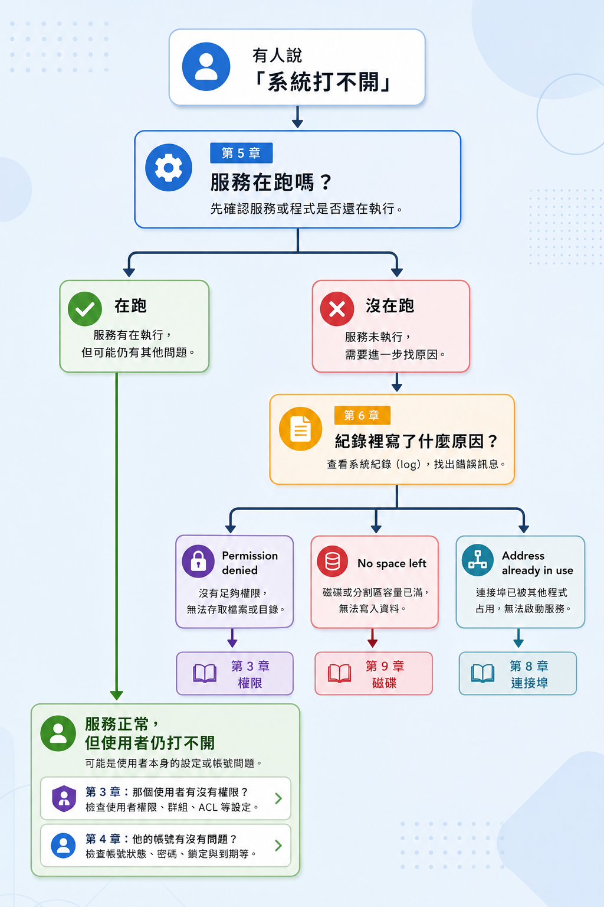

# 這十章在實際工作裡怎麼配合
 

## 每一章負責什麼
 

| # | 章節 | 它回答的問題 | 核心指令 |
| :--- | :--- | :--- | :--- |
| 1 | 定位與觀察 | 我在哪個目錄？這裡有哪些檔案？ | `pwd` `ls -l` `cd` |
| 2 | 搜尋 | 我要找的檔案在哪個目錄？ | `find` `grep` |
| 3 | 權限 | 誰可以讀寫這個檔案？ | `ls -l` `chmod` `chown` |
| 4 | 帳號 | 誰可以登入這台機器？ | `/etc/passwd` `usermod` |
| 5 | 服務 | 該執行的服務有沒有在執行？ | `systemctl` |
| 6 | 日誌 | 剛才發生了什麼？ | `journalctl` `grep` |
| 7 | 套件 | 裝的是哪一個版本？ | `apt policy` |
| 8 | 網路 | 對外開放了哪些連接埠？ | `ss` `ufw` |
| 9 | 磁碟 | 磁碟還剩多少空間？ | `df` `du` |
| 10 | 綜合 | 從哪裡查起？ | 以上全部 |

---
 

## 實際排查時的順序
 

 

